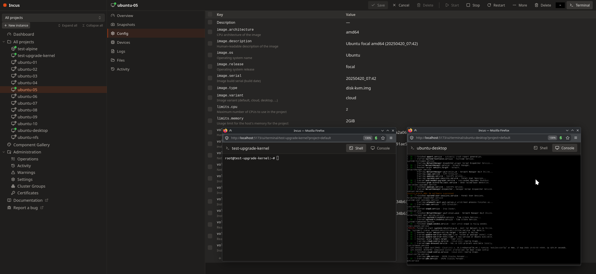

# ixui — Incus Web UI

> [!WARNING]
> **Pre-alpha.** ixui is in early, pre-alpha development — expect missing
> features, rough edges, and breaking changes. Don't rely on it to manage
> production Incus servers yet.

A hand-crafted React web UI for Incus. Dark Proxmox-style theme with ESXi-style
layout, built entirely on a custom component system (no UI libraries). Features
a cluster-aware member/instance tree, a project selector, vertical tabs for
instance views, and a floating create-instance wizard.



## Features

- **Authentication** — TLS client certificate or OIDC sign-in, including
  `user.ui.sso_only` redirect mode.
- **Sidebar tree** — cluster members with their instances (flat list on
  standalone servers), project selector with an all-projects mode,
  expand/collapse all, create-instance button, and a right-click context menu
  on instances (start / stop / restart / terminal / rename / delete / move to
  node).
- **Instances** — create wizard (simplestreams catalog + cached images,
  profiles, storage pool, cluster member targeting); detail view with
  Overview, Snapshots (create/restore/delete + an automatic-snapshots editor
  for `snapshots.schedule`/`snapshots.expiry` with an enable switch), Config
  editor with server-side key descriptions, Devices editor, Logs, Files, and
  per-instance Activity tabs; lifecycle actions (start/stop/restart/freeze),
  rename, copy, move (across projects and cluster members, optionally live),
  delete, and backup export download; VM display thumbnail.
- **File explorer** — browse an instance's filesystem with back/forward and a
  path bar, open and edit text files in place, upload and download files,
  create directories, and delete entries.
- **Terminal** — popup shell terminal per instance, with a VGA (SPICE) console
  toggle for VMs.
- **Images** — local image list, pull from simplestreams remotes, alias
  management.
- **Networks** — create/delete networks and manage network forwards.
- **Network ACLs** — project-scoped ACLs with an Oracle Cloud-style inline
  rule editor (ingress/egress tables, action dropdown with icons, prefilled
  protocol list, pfSense-like enable/disable and logging indicators, confirmed
  rule removal) in a large draggable window; attach to NICs via the
  `security.acls` device option.
- **Storage** — create pools, manage custom volumes (create, rename, delete,
  snapshots), upload ISOs.
- **Profiles & projects** — full CRUD with config editors.
- **Cluster** — member overview and capacity, evacuate/restore, join tokens,
  cluster groups.
- **Server administration** — settings editor, warnings, operations log with a
  persistent task bar, activity (lifecycle event) log, certificates.
- **Realtime** — the Incus events websocket drives live instance status and
  operation updates.
- **Component system** — custom-built primitives (no UI libraries) with a
  browsable gallery.

## Not yet implemented

- Network zones, peers, address sets, and load balancers (API client
  groundwork exists, no UI).
- Storage buckets.
- Backup management — only one-off export downloads today; no backup
  list/restore/import.
- Image upload, export, or property editing.
- Instance rebuild.
- Metrics history / usage graphs (only current usage numbers are shown).
- User, group, and identity management (OpenFGA).
- Light theme, responsive/mobile layout, and localization.

## Development

Requirements: local incusd reachable at `https://127.0.0.1:8443`, client cert in
`~/.config/incus/` (generate with `incus list` if missing).

```bash
incus config set core.https_address :8443
npm install
npm run dev
```

Open http://localhost:5173/ui/. The Vite plugin proxies `/1.0`, `/1.0/events`,
and `/oidc` to incusd using your client cert. Override with `INCUS_CERT_DIR`
and `INCUS_TARGET` env vars.

`lucide-react` is the only icon dependency (component system rule: no other UI
libraries).

The instance Terminal opens in a browser popup at `/ui/terminal/<instance>` with
a shell (and VGA toggle for VMs). The sidebar tree's `+` buttons create
instances, targeted at the hovered cluster member. Config-key descriptions come
from `GET /1.0/metadata` — enable them on the server with
`incus config set metadata.enabled true` (the UI shows "—" when unavailable).

## Testing

```bash
npm test        # vitest unit + component tests
npm run typecheck
npm run lint
```

## Production (served by incusd at /ui/)

```bash
npm run build
```

Copy the contents of `dist/` into incusd's UI assets directory (commonly
`/usr/share/incus/ui` — confirm the path on your distro), then restart incusd:

```bash
sudo cp -r dist/* /usr/share/incus/ui/
sudo systemctl restart incus
```

Browse to https://your-host:8443/ui/. Authentication is automatic when your
browser has the server's client certificate installed, or via OIDC otherwise.

## Component system

Design tokens live in `src/styles/theme.css` (`@theme`). Primitives live in
`src/components/`, each with unit + component tests — including Window
(now with configurable size), Dialog (regular + wide), Loading,
SnapshotSchedule, VerticalTabs, and ProjectDropdown. The gallery at
http://localhost:5173/ui/gallery shows every component and its variants.

## AI-assisted development

ixui is developed with substantial help from AI / LLM coding tools. Generated
code is human-reviewed and covered by the test suite, but given the pre-alpha
state you should apply the usual scrutiny before trusting it with your servers.
Bug reports are very welcome.

## License

Copyright 2026 Salem Alsaiari

ixui is licensed under the [Apache License 2.0](LICENSE).
